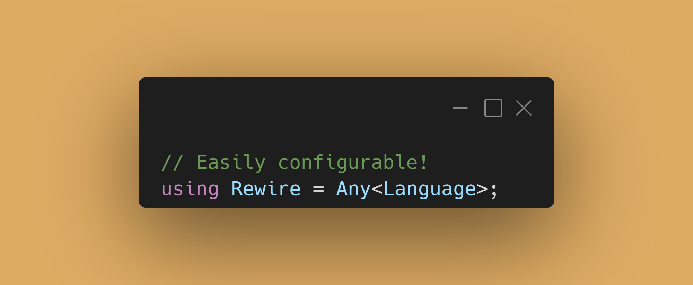

# Rewire

  

# What is it?
Rewire is a "programming language framework". The way it works is
by editing a user-provided file (`Desription.ixx` in the
`src` directory) by following the instructions found there.  
Long story short: Rewire makes you define the syntax and (soon) the
semantics of your own programming language, with next to no
limitations.
# How complete is it at the moment?
The basic constructs for building Rewire grammars are in place:
## Lexer
- Not
  - This lets you specify which types of tokens you want to reject.
  - Only `Not<Punctuations>` is currently supported.
- Either
  - It lexes Exactly one (the first found) of the specified types.
  - Fully implemented but untested.
- Any
  - Accepts a single token type (possibly a compound one!) and
  - lexes it over and over until it can't anymore.
  - Example (for more, see the wiki):
    - `Any<Seq<std::string, Punctuation<' '>>>`
    - The snippet above lexes (multiple instances of) any string
      (don't do this! it's just for a demonstration! it won't work!!)
      followed by a space.
    - Fully implemented and tested.
- Seq
  - Accepts a series of tokens, and lexes exactly one of them
    each, in sequence, and in the order they're provided.
    - Note: if one of the token types is an `Any`, it will
      keep parsing that `Any` until it can't anymore, and then
      it will move on. There can be multiple `Any`s in a `Seq`.
  - Fully implemented and tested.

## Parser

- List
  - Accepts a series of token types, and parses each one of them
    exactly once. Effectively equivalent to a lexer's `Seq`.
- Repeat
  - Just like a lexer's `Any`.
- Ignore
  - Used to forget about a specific token in a specific position
  - in a `List` or other control flow tokens:
    - `List<Ignore<Punctuation<'('>>, Name, Punctuation<')'>>`
      ignores a '(' and a ')' at the end of the above List.
      They will not be present in the generated AST, so it's
      useful to remove arbitrary syntax and only keep its meaning.
- Punctuation/Punctuations
  - They work just like in the lexer, but with parsing in mind.
- Not
  - It works just like in the lexer.

In `Description.ixx` you'll see a bunch of stuff explicitly not
supposed to be edited by the user. Don't touch that. Later, you'll
be introduced to user-editable stuff, such as what tokens are
punctuation tokens and what forms you want to parse. The standard
forms can be freely edited and removed if you wish, and you can
define your own. The types you'll find in the source tree are:

- Statement
  - This is the basic form of a statement in your language.

- Lambda
  - This will be the form of lambda functions in your language.

- Pattern
  - This will be a pattern in a pattern matching operation.
- Executable
  - This will be an external executable call, much like how a
    shell would do it.
- ProgramPipe
  - Composition of external executable, much like '|' in Bash.
- Composition
  - Function composition in your language.
- FuncDefinition
  - Function definitions in your language.

**A very important thing to note is that there's nothing in the
default configuration that must not be edited! You can do whatever
you want! If you feel like so, you can very much delete all of
the above configurations and write your own from scratch.**

The way you tell the lexer which forms to lex against is by writing
a very special `Either<Ts...>` where `Ts...` is your sequence of
forms. This form will be called `Forms` and it **must** be present.
As an example, this is the default `Forms` form:

```cpp
using Forms =  Either<FuncDefinition, Name, Statement,
					  ArgumentList, Composition, ProgramPipe,
					  Executable, Pattern, Lambda>;
```

For the parser, instead, you'll need to not think about what
lexical form your phrases have, but instead what's their semantics.
The way to do this is by (details are in `Descriptions.ixx` as
always) defining specific instances of a provided struct with
a description of how each token type must be parsed:

```cpp
template <> struct Describe<Statement> {
  using what = List<Ignore<Punctuation<'('>>
                    ArgumentList,
                    Name,
                    Ignore<Punctuation<')'>>>;
};
  
```

Above is the definition of the structure of a "statement" in the
default Rewire language. It's basically an unparsed '(' followed
by an ArgumentList (which, in reality, also contains the function
name!), another argument, and ends with a closing ')'.
Only `ArgumentList` and `Name` will be in the final AST.

# So... does it work?
The lexer and parser are mostly in place. The only thing really
left is the visitor.

# What if i want to ask questions not answered here?
See the wiki (TODO) or open an issue, or contact me on Telegram
(@SwitchAxe) and i'll be happy to answer anything.
